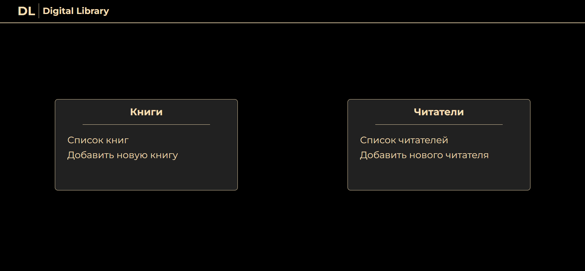
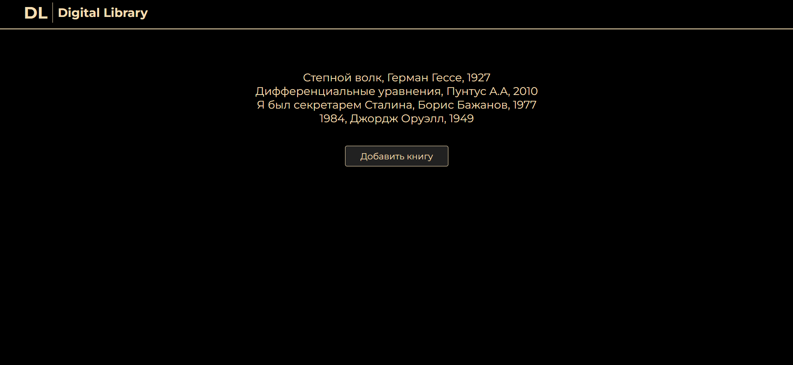
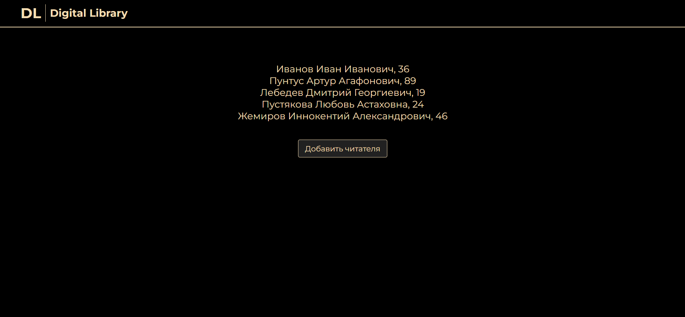
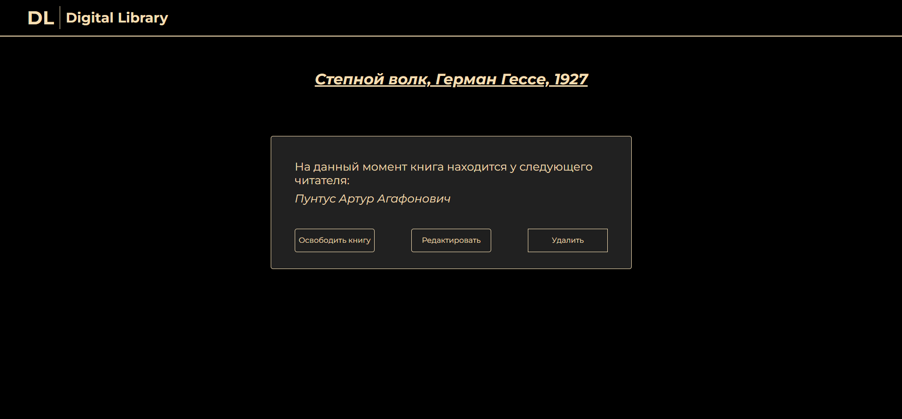
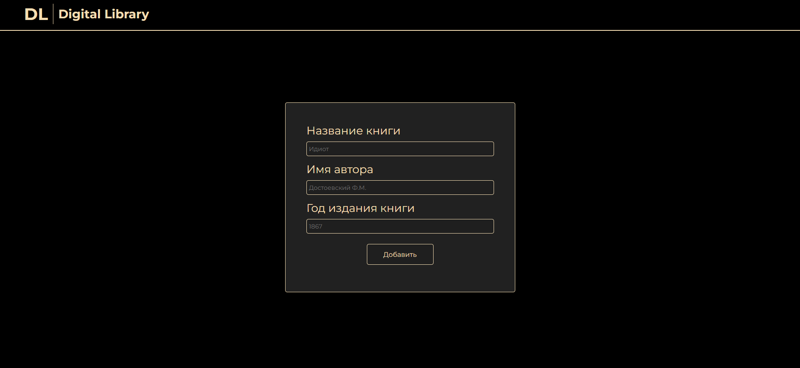
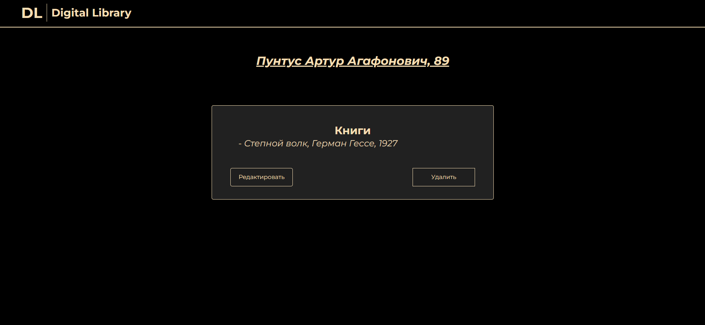
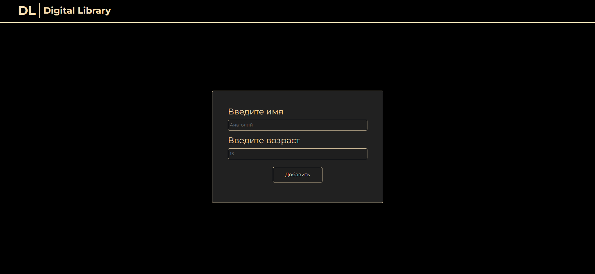

# DigitalLibrary - веб-приложение для электронного учета книг 

### В рамках проекта было разработано веб-приложение для электронного учета книг.

## Зоны ответственности участников проекта

Разработка алгоритма и реализация: [**Яруллин А.Р.**](https://github.com/nesrayr)

Оформление сайта: [**Знай А.О.**](https://github.com/znako)

## Пример работы приложения

### Начальная страница

### Список книг 

### Список читателей

### Страница книги 

### Добавление книги 

### Страница читателя 

### Добавление читателя 

# DigitalLibrary
